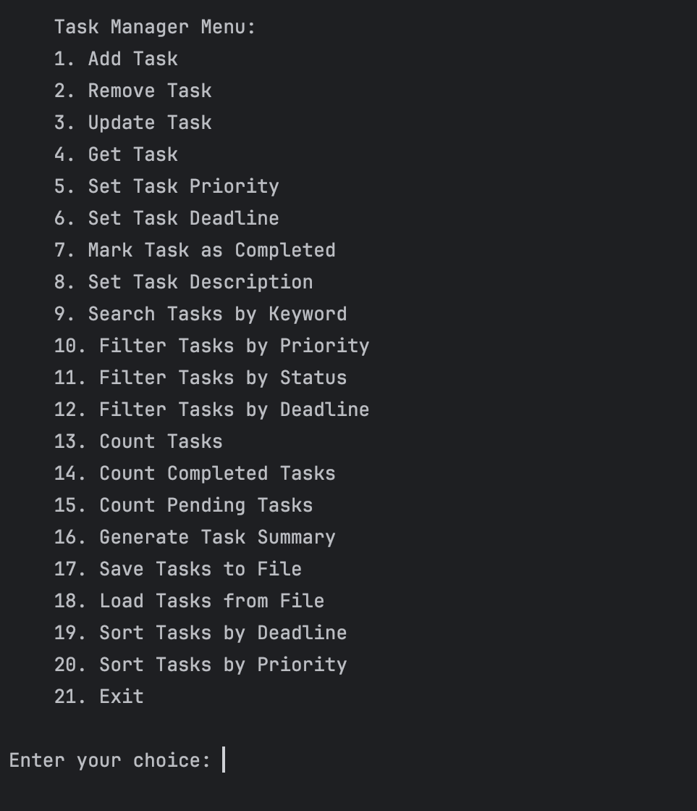

# Task Manager System 📝

  

## ℹ️ Project Overview
The idea of this project is to be created a basic console-based task manager application with a user menu to interact with it. It provide a wide variety of functions that handle various tasks such as creating, updating, deleting, and managing tasks, as well as generating reports and performing searches.

## 💻 Tech stack:

## ✅ Functions that the system provide: 
* Add a new task. 
* Remove an existing task.
* Update task.
* Get task.
* Set Task Priority.
* Set Task Deadline
* Mark Task as Completed
* Set Task Description
* Search Tasks by Keyword
* Filter Tasks by Priority
* Filter Tasks by Status
* Filter Tasks by Deadline
* Count Tasks
* Count Completed Tasks
* Count Pending Tasks
* Generate Task Summary
* Save Tasks to File
* Load Tasks from File
* Sort Tasks by Deadline
* Sort Tasks by Priority

## ⁉️ How to use?

Upon starting the console application, the user sees a menu with available options provided by the software solution. At the first start of the program, the task list is completely empty. The options that the user can choose from are as follows:

1. **Add Task**
    - When this option is selected, the user must enter the task’s 'id', which is a unique identifier for the task. This number is used to identify the specific task and plays a role in many of the other possible options. The user also needs to enter a description of the task, the task's priority (low, medium, or high), and the task's deadline. The deadline for the task must be entered in the following format - YYYY-MM-DD. If any field is entered incorrectly, the user is prompted to re-enter the data for the specific fields until the data meets the requirements. By default, every new task added to the list is in an incomplete state.

2. **Remove Task**
    - If the user selects this option, they must specify the identification number of the task they want to remove from the list. If a task with a non-existent identification number is specified, the user must re-enter it.

3. **Update Task**
    - When this option is selected, the user must enter the identification number of the task they want to update, after which the system prompts them to fill in all the fields of the task they want to update.

4. **Get Task**
    - If the user wants to check a task, they must choose this option and specify the identification number of the task they want to check. The result of this option is that all fields of the specific task are displayed on the screen.

5. **Set Task Priority**
    - If the user wants to change the priority of a specific task, this option allows them to do so by providing the system with the task's identification number and the new priority they want to assign to the task.

6. **Set Task Deadline**
    - This option allows the user to change the deadline of a specific task. They must specify the task's identification number and the new deadline.

7. **Mark Task As Completed**
    - If the user wants to change the status of a specific task from 'pending' to 'completed', they can do so by selecting this option and specifying the identification number of the task whose status they want to change.

8. **Set Task Description**
    - This option allows the user to change the description of a specific task. The user needs to enter the identification number of the task whose description they want to change, as well as the updated description.

9. **Search Tasks By Keyword**
    - This option allows the user to search for tasks by keywords. The user enters a keyword by which they want to filter tasks and receives a list of all tasks containing this keyword in their description.

10. **Filter Tasks by Priority**
    - This option allows the user to filter tasks by priority and get a list of tasks with the specific chosen priority (low, medium, high).

11. **Filter Tasks by Status**
    - This option provides the ability to filter tasks based on their status (completed/pending). The user must enter the status by which tasks will be filtered and receives a list of tasks with the specific status.

12. **Filter Tasks by Deadline**
    - When this option is selected, the user must enter a deadline for which they want to see the tasks and as a result, receives a list of tasks with the specific deadline.

13. **Count Tasks**
    - This option allows the user to check the number of all tasks that are part of the list.

14. **Count Completed Tasks**
    - This option allows the user to check the number of all completed tasks that are part of the list.

15. **Count Pending Tasks**
    - This option allows the user to check the number of all pending tasks that are part of the list.

16. **Generate Task Summary**
    - When this option is selected, the user receives a summary note with the number of unfinished tasks, the number of finished tasks, and the total number of all tasks.

17. **Save Tasks to File**
    - If the user wants to save their task list for future use (i.e., after ending the program), this option does so by saving the current task list to a JSON file. The only thing the user needs to do when choosing this option is to enter the full path and name of the file in which they want to save the task list (if the user wants the file to be saved in the directory where the software solution is located, they just need to enter the name of the file in which they want to save the task list).

18. **Load Tasks from File**
    - This option allows the user to load a task list from an existing file when starting the program. They need to enter the full path to the file where the saved records are located. (The file must be in JSON format and saved by the respective program. Also, if the file is located in the directory where the program is located, the user does not need to enter the full path to the file, just its name).

19. **Sort Tasks by Deadline**
    - When this option is selected, the task list is sorted in ascending order according to the task deadlines.

20. **Sort Tasks by Priority**
    - When this option is selected, the task list is sorted in ascending order according to the priority (low -> medium -> high) of the tasks.

21. **Exit**
    - When this option is selected, the user terminates the program and exits it.
   
## 🧑‍💻 User Menu:

  

## 📁 File Example 
[Click here for result file example](https://github.com/todorpeychinov/Task_manager_system/blob/main/example_file)

